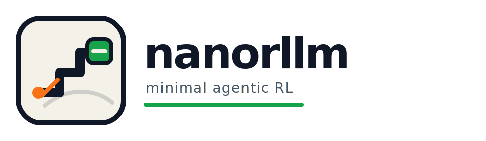

<p align="center">
  
</p>

<p align="center">
  <strong>A minimal, readable playground for agentic RL</strong>
</p>

一个尽量小、但仍然保留 `agentic RL` 关键闭环的宝藏仓库。

## 这是什么

`nanorllm` 不是完整复刻 [`rllm`](https://github.com/agentica-project/rllm)，而是把最值得先跑通的一条链路压缩成一个可以读、可以跑、可以改的小版本。

当前 demo 是：

- `multi-turn math self-refine`
- 本地 `transformers` causal LM
- actor-only 的最小 GRPO/PPO-style on-policy 更新
- 支持把 rollout 导出成可视化 JSON，用浏览器查看整条 trajectory

## 这不是什么

这个仓库刻意不做下面这些事：

- Ray / verl / async worker
- critic
- replay buffer
- 大规模工程化配置系统

换句话说，它更像一个“最小可解释原型”，不是“可横向扩展的完整训练平台”。

## 当前主线


1. `MathEnv` 给出题目或 retry feedback
2. `MathAgent` 维护 messages，并把交互写进 `Trajectory`
3. `HFCausalPolicy` 基于当前 messages 采样回复
4. `RolloutEngine` 驱动一条完整 episode，并记录 `StepRolloutView`
5. `execute_tasks` 对同一题做多次采样，得到一组 `Rollout`
6. `group_by_task_id + compute_advantage` 计算 grouped advantage
7. `trainer` 把 rollout 转成 `TrainSample`，再做 loss 和 `optimizer.step()`

当前训练范式是最小的 on-policy actor-only loop：

- rollout 由当前 policy 现采
- `old_logprobs` 来自 rollout 时的旧策略
- 默认训练视图是 `step`

如果你想体验更接近 cumulative chat agent 的训练视图，也可以切到 `prefix-compatible-episode-as-sequence`。

## 适合谁

这个项目尤其适合下面几类场景：

- 想快速理解 agentic RL 的最小数据流
- 想在一个很小的代码库里改 reward / env / rollout / loss
- 想把“多轮对话轨迹”和“训练 token 视图”拆开理解
- 想做一个可控、可调试、可视化的 math self-refine 实验

## 快速开始

### 1. 环境准备

要求：

- Python `3.11` 到 `3.13`
- 首次运行需要能下载 Hugging Face 模型

创建虚拟环境并安装依赖：

```bash
python -m venv .venv
. .venv/bin/activate
pip install -U pip
pip install -e ".[dev]"
```

默认依赖很少：

- `torch`
- `transformers`
- `python-dotenv`
- `pytest`（开发依赖）

### 2. 运行主示例

```bash
.venv/bin/python examples/train_math_grpo.py
```

默认配置在 [examples/train_math_grpo.py](/Users/sl/caitian/nanorllm/examples/train_math_grpo.py) 里：

- 模型：`HuggingFaceTB/SmolLM2-135M-Instruct`
- 设备：`cpu`
- 每题采样数：`2`
- 最大 rollout step 数：`5`
- 默认训练视图：`step`

### 3. 你会得到什么

运行结束后，通常会看到两类产物：

- 训练日志：包括 rollout 收集、样本数、loss、平均 advantage
- 轨迹导出：`docs/exported_trajectories.json`

这个 JSON 可以直接喂给 viewer 查看：

1. 用浏览器打开 [docs/trajectory_viewer.html](/Users/sl/caitian/nanorllm/docs/trajectory_viewer.html)
2. 选择 `docs/exported_trajectories.json`

viewer 的输入格式说明在 [docs/trajectory_viewer_README.md](/Users/sl/caitian/nanorllm/docs/trajectory_viewer_README.md)。

## 最小运行流程

主入口的训练逻辑可以近似理解成：

```python
rollouts = execute_tasks(tasks, args.num_samples_per_task, rollout_fn)
samples = build_samples_from_rollouts(rollouts, policy, args)
batch = collate_train_batch(samples, tokenizer, args, device=policy.device)
logits = policy.forward(batch["input_ids"], batch["attention_mask"])
loss = compute_policy_loss(logits, batch, args)
loss.backward()
optimizer.step()
```

其中最重要的不是“公式有多复杂”，而是这几层边界是清楚的：

- `agent` 管对话状态和 trajectory 写入
- `env` 管环境转移和 reward
- `rollout` 管 episode 采样
- `trainer` 管训练视图、batch、loss 和优化

## 核心对象

`Step`

- 一轮 `observation -> model_response/action -> env feedback` 的记录单元
- 只保留交互语义，不直接承载训练 token 字段

`Trajectory`

- 一个完整 episode 的容器
- 包含 `task_id`、`steps`、`final_reward`、`terminated`、`termination_reason`

`StepRolloutView`

- rollout 阶段记录的一步训练视图
- 保存 `prompt_ids`、`response_ids`、`response_logprobs`

`Rollout`

- rollout/collector 对 trainer 的统一输出对象
- 绑定 `trajectory`、`step_views`、`task`
- 允许挂载 `run_id`、`stats`、`timing` 这类收集侧 metadata

`TrainSample`

- trainer 最终消费的训练样本
- 当前支持两种视图：`step` 和 `prefix-compatible-episode-as-sequence`

## 两种训练视图

### `step`

默认模式，也是当前最直接的训练视图。

- 每个 step 生成一个训练样本
- `input_ids = prompt_ids + response_ids`
- loss 只打在当前 response token 上
- 最容易观察和调试

### `prefix-compatible-episode-as-sequence`

更接近 cumulative chat agent 的整段序列训练视图。

- 一个 episode 只生成一个训练样本
- 要求每一步 prompt 都是最终 prompt 的前缀
- 用最后一步的完整上下文拼出整条训练序列

当前示例默认还是 `step`。如果你要切换，可以改 [examples/train_math_grpo.py](/Users/sl/caitian/nanorllm/examples/train_math_grpo.py) 里的 `TrainArgs.mode`。

## 任务与环境约定

当前 task schema 固定为：

```python
{
    "task_id": "gsm8k-001",
    "question": "...",
    "answer": "42",
}
```

当前环境规则：

- `reset(task)` 返回 `{"question": ...}`
- 回答正确：`done=True, reward=1`
- 回答错误且未超轮数：`done=False, reward=0`
- 超过最大轮数仍错误：`done=True, reward=0`

reward 判定由 [nanorllm/rewards/math_reward.py](/Users/sl/caitian/nanorllm/nanorllm/rewards/math_reward.py) 负责，支持：

- 从 `\boxed{...}` 抽取答案
- 兼容 `\box{...}` 别名
- 对纯文本数值答案做标准化，例如 `39.0 -> 39`

## 项目结构

```text
nanorllm/
  datasets/
    simple_math.py
  docs/
    trajectory_viewer.html
    trajectory_viewer_README.md
  examples/
    train_math_grpo.py
  nanorllm/
    agents/
      base.py
      math_agent.py
    algos/
      grpo.py
    core/
      trajectory.py
      types.py
    envs/
      base.py
      math_env.py
    policy/
      base.py
      hf_causal.py
    rewards/
      base.py
      math_reward.py
    rollout/
      collector.py
      engine.py
    trainer/
      collate.py
      loss.py
      trainer.py
    utils/
      util.py
  tests/
```

建议从这些文件开始读：

- [examples/train_math_grpo.py](/Users/sl/caitian/nanorllm/examples/train_math_grpo.py)：主入口
- [nanorllm/rollout/engine.py](/Users/sl/caitian/nanorllm/nanorllm/rollout/engine.py)：单条 episode 怎么跑
- [nanorllm/trainer/trainer.py](/Users/sl/caitian/nanorllm/nanorllm/trainer/trainer.py)：rollout 怎么变成训练
- [nanorllm/trainer/collate.py](/Users/sl/caitian/nanorllm/nanorllm/trainer/collate.py)：两种训练视图的关键实现
- [nanorllm/rewards/math_reward.py](/Users/sl/caitian/nanorllm/nanorllm/rewards/math_reward.py)：答案抽取与 reward

## 测试

运行测试：

```bash
.venv/bin/pytest
```

当前测试主要覆盖：

- rollout engine 的终止行为
- math reward 的答案抽取与标准化
- `step` / `prefix-compatible-episode-as-sequence` 两种训练视图
- collector 的批量 rollout 行为

## 设计边界

这个仓库保留了一个很现实的 trade-off：

- 交互语义走 `Trajectory`
- rollout 时的 token 级训练事实走 `StepRolloutView`
- trainer 真正吃进去的 batch 数据走 `TrainSample`

也就是说，交互记录和训练记录仍然来自同一条 episode，但它们已经是三条清晰分离的视图，不再混在同一个 `Step` 对象里。

## 下一步可以怎么改

如果你准备在这个仓库上继续实验，通常有几个自然方向：

- 换 reward 规则，观察 self-refine 行为变化
- 改 task 数据集，不局限于简单算术
- 把默认训练视图从 `step` 切到 episode 级视图
- 增加更多 rollout metadata，配合 viewer 调试
- 引入更完整的 PPO/GRPO 训练细节

如果你只想先读懂一遍代码，最短路径是：

1. 先跑 [examples/train_math_grpo.py](/Users/sl/caitian/nanorllm/examples/train_math_grpo.py)
2. 再看 [nanorllm/rollout/engine.py](/Users/sl/caitian/nanorllm/nanorllm/rollout/engine.py)
3. 最后看 [nanorllm/trainer/collate.py](/Users/sl/caitian/nanorllm/nanorllm/trainer/collate.py) 和 [nanorllm/trainer/trainer.py](/Users/sl/caitian/nanorllm/nanorllm/trainer/trainer.py)

## 致谢

这个仓库的很多思路来自对 [`rllm`](https://github.com/agentica-project/rllm) 的学习和拆解。

感谢 `rllm` 项目把 agentic RL 的关键问题、对象分层和训练主链路做了很有启发性的工程化表达，也给了这个 `nanorllm` 一个很明确的出发点。
